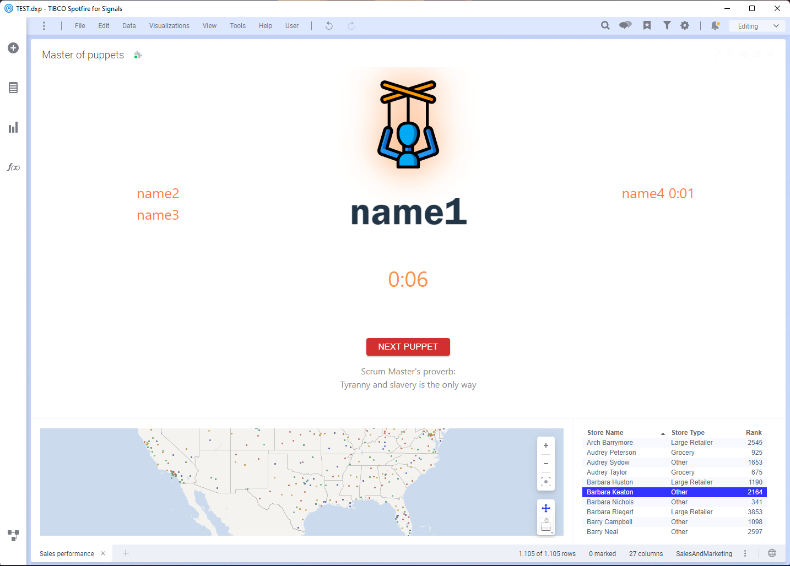

# MasterOfPuppets

## Basic to start

- Install node: https://nodejs.org/en
- Install yarn: npm install --global yarn 

## Execute with Spotfire Mods

Just need to drag and drop the `spotfire/MasterOfPuppets.mod` file to any dxp file. Make sure you have enabled mods in Spotfire configuration.
- Edit people configuration file adding desired names:

```text
    src/data/puppets.json
```

<div style="display: flex; justify-content: center; align-items: center">
    
</div>


## Run

- Download node modules:

```text
    yarn
```

- Execute project:

```text
    yarn dev
```


## Build (not necessary for scrums)

```text
    yarn build
```

## Generate electron build (not necessary for scrums)
```text
    yarn buildElectron
```

## Docker:
```sh
    docker compose up
```